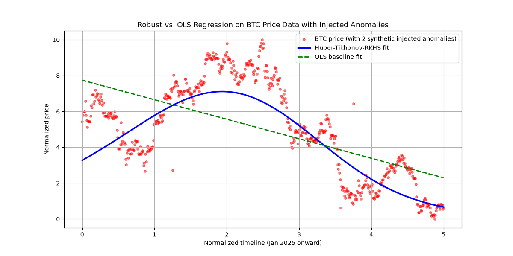

# Robust Regression Engine: Tikhonov-Regularized Huber Regression in RKHS

A Python implementation of **Tikhonov-Regularized Huber Regression** in a **Reproducing Kernel Hilbert Space (RKHS)**, illustrating a technique from recent robust statistical learning theory. Unlike ordinary least squares, this approach substantially reduces the influence of heavy-tailed noise and extreme outliers when fitting a trend to noisy data.

## Theoretical Background

This implementation is inspired by the framework of Huber-loss regression regularized via a Tikhonov (RKHS-norm) penalty, combining three ingredients:

1. **Huber Loss**: penalizes small errors quadratically (as in least squares) but switches to a linear penalty beyond a threshold σ, which sharply reduces — though does not eliminate — the leverage of extreme residuals on the fit.
2. **RKHS / Mercer Kernels**: projects the input into a higher-dimensional feature space (here, via an RBF kernel) so the model can capture non-linear trend structure without manual feature engineering.
3. **Tikhonov Regularization**: penalizes model complexity in RKHS norm, keeping the fit anchored to the macro trend rather than chasing every local fluctuation.

**Reference**: Hongzhi Tong, "Learning theory of regularized Huber regression," *Applied and Computational Harmonic Analysis*, 85 (2026), 101894. This paper provides a rigorous statistical learning analysis (leave-one-out generalization bounds and learning rates) for this exact estimator, and is the theoretical basis for the approach used here.

### What the theory actually shows — and what it doesn't

It's worth being precise about what "robustness" means in this context, since it's easy to overstate:

- The cited paper shows that, **under a symmetric-noise assumption and a finite p-th moment condition (1 < p ≤ 2)** — which allows for infinite-variance, heavy-tailed noise — the regularized Huber estimator still achieves meaningful generalization error rates as sample size grows. This is a statement about *asymptotic learning-rate guarantees*, not a claim that any single outlier, of any size, has zero effect on the fit.
- Critically, those guarantees hold when the regularization parameter λ and the Huber threshold σ are **jointly tuned according to explicit formulas tied to the sample size** (see Theorem 1 in the paper). This implementation currently uses fixed, manually chosen values for `lambda_param`, `sigma`, and `gamma` — it has **not** been tuned to satisfy the paper's theoretical conditions. Treat the current defaults as a reasonable heuristic starting point, not a theoretically guaranteed configuration.
- The paper's own analysis is purely theoretical — it does not include numerical experiments (its "Data availability" statement confirms no data was used in that work). The demo in this repository is therefore an independent numerical illustration of the underlying idea, not a reproduction of results from the paper.
- The symmetric-noise assumption underlying the theory is a real limitation for financial return data, which is typically **asymmetric** (crashes tend to have a fatter, faster tail than rallies). This doesn't invalidate the approach, but it means the theoretical guarantees don't directly transfer to markets without further justification.

## Empirical Demo (Illustrative, Not a Theoretical Reproduction)

The included script fits this model to historical Bitcoin (BTC-USD) daily closing prices (January 2025–present, via the Yahoo Finance API), with two synthetic outliers manually injected at the 25% and 75% marks of the series to visualize how the fit responds to extreme, isolated anomalies.


**What the plot shows:**
- The fitted trend line is markedly less pulled toward the injected anomalies than an ordinary least-squares fit would be, consistent with Huber loss down-weighting large residuals.
- The kernel-based fit captures non-linear trend curvature rather than a rigid straight line.
- The Tikhonov penalty keeps the fit focused on the macro trend rather than daily noise.

**What this demo does *not* establish:**
- It does not test the model against real, uncontrolled market anomalies — the injected outliers are large, synthetic, and known in advance.
- It says nothing about predictive or trading performance. A smoothed trend line is inherently backward-looking; it cannot distinguish, in real time, between a transient anomaly and the early stage of a genuine trend reversal.
- It does not verify the sample-size-dependent tuning conditions required by the cited theory (see above).

## Project Structure & Quick Start

### Installation

```bash
pip install numpy scipy scikit-learn matplotlib yfinance
```

### Usage

```bash
python huber_trend_demo.py
```

This fetches BTC-USD data, fits the model, and saves a comparison chart to `huberloss_real_data.png`.

## Limitations

- Hyperparameters (`lambda_param`, `sigma`, `gamma`) are currently set manually rather than via the sample-size-dependent schedule prescribed by the theory, or via cross-validation.
- The optimizer (`scipy.optimize.minimize` with BFGS, no analytic gradient) scales poorly with the number of data points; for larger datasets, an IRLS-based solver would be more efficient and is a planned improvement.
- No comparison against a standard OLS or Ridge baseline is currently included in the script; adding one would make the robustness claims easier to verify visually and numerically.
- This is a research-inspired demo, not a production trading signal system. It should not be used as the sole basis for financial decisions.

## License

This project is licensed under the MIT License — see the [LICENSE](LICENSE) file for details.
