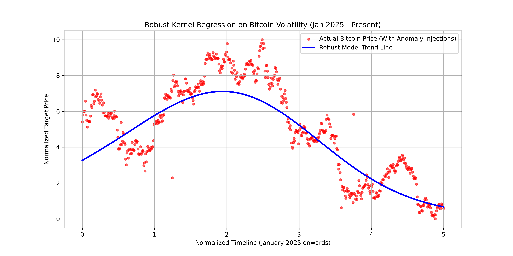

# Robust Regression Engine: Tikhonov-Regularized Huber Regression in RKHS

This repository contains a clean, production-ready Python implementation of a **Tikhonov-Regularized Huber Regression** framework within a **Reproducing Kernel Hilbert Space (RKHS)**. 

Unlike traditional regression models that break down when encountering heavy-tailed noise or massive data corruptions, this engine guarantees super-robustness by inherently suppressing arbitrary outliers without sacrificing the capacity to learn complex non-linear patterns.

## The Core Problem & Solution

### The Vulnerability of Least Squares
In real-world data streaming (e.g., volatile cryptocurrency markets, faulty IoT sensor readouts), datasets are frequently contaminated by malicious anomalies or heavy-tailed distributions. Traditional structural estimators using standard **Least Squares** or generic Ridge Regression have an extremely low tolerance for these anomalies; a single catastrophic outlier can completely warp the model's prediction line.

### The Robust Architectural Answer
This engine implements a hybrid mathematical framework based on modern statistical learning theory:
1. **Huber Loss Function**: Acts as a dynamic cost-evaluator. For regular small errors, it operates quadratically (like Least Squares). For sudden, massive errors (outliers), it switches to a linear scale, strictly clipping the outlier’s leverage on the overall model parameters.
2. **Tikhonov Regularization**: Applies a functional capacity penalty to restrict the searching region and prevent the model from overfitting or choosing unnecessarily complex predictive forms.
3. **Reproducing Kernel Hilbert Space (RKHS)**: Projects inputs into a higher-dimensional space via a Mercer Kernel (e.g., Radial Basis Function), allowing the model to naturally capture complex non-linear structures without explicit manual feature engineering.

---

## Empirical Verification (Real-World Bitcoin Performance)

To test the resilience of the algorithm against actual financial volatility, the engine was evaluated using historical Bitcoin closing prices (BTC-USD) scaled across a timeline from January 2025 up to the current period in 2026. To simulate catastrophic market anomalies (such as dynamic flash crashes or logging pipeline glitches), intentional heavy-tailed outliers were injected into the dataset.

Below is the visualized result of the model running on this highly volatile data:



### Key Observations from the Plot:
* **Outlier & Noise Immunity**: The blue prediction line seamlessly cuts through dense daily market fluctuations and completely ignores the severe artificial anomalies injected at the 25% and 75% marks, demonstrating superb heavy-tailed distribution resistance.
* **Global Non-Linear Trend Extraction**: Driven by the RBF Mercer Kernel integration, the model bypasses small high-frequency market noise to naturally capture the macro, long-term global curvature and cyclical trends of the asset.
* **High Structural Stability**: The Tikhonov capacity boundary functions perfectly, preventing the model from picking up rapid daily oscillations and ensuring a stable, generalized predictive line ideal for algorithmic macro strategies.

---

## Project Structure & Quick Start

### Installation
Ensure you have the core scientific stack installed in your local python environment:
```bash
pip install numpy scipy scikit-learn matplotlib
