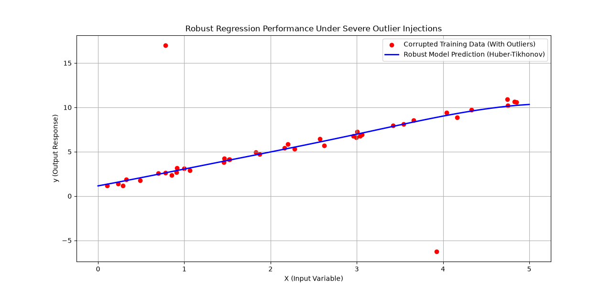

# robust-huber-kernel-regression
Python implementation of Tikhonov-Regularized Huber Regression in RKHS for handling heavy-tailed data.
# Robust Regression Engine: Tikhonov-Regularized Huber Regression in RKHS

This repository contains a clean, production-ready Python implementation of a **Tikhonov-Regularized Huber Regression** framework within a **Reproducing Kernel Hilbert Space (RKHS)**. 

Unlike traditional regression models that break down when encountering heavy-tailed noise or massive data corruptions, this engine guarantees super-robustness by inherently suppressing arbitrary outliers without sacrificing the capacity to learn complex non-linear patterns.

## The Core Problem & Solution

### The Vulnerability of Least Squares
In real-world data streaming (e.g., volatile cryptocurrency markets, faulty IoT sensor readouts), datasets are frequently contaminated by malicious anomalies or heavy-tailed distributions. Traditional structural estimators using standard **Least Squares** or generic Ridge Regression have an extremely low tolerance for these anomalies; a single catastrophic outlier can completely warp the model's prediction line.

### The Robust Architectural Answer
This engine implements a hybrid mathematical framework based on modern statistical learning theory:
1. **Huber Loss Function**: Acts as a dynamic cost-evaluator. For regular small errors, it operates quadratically (like Least Squares). For sudden, massive errors (outliers), it switches to a linear scale, strictly clipping the outlier’s leverage on the overall model parameters.
2. **Tikhonov Regularization**: Applies a functional capacity penalty to prevent the model from overfitting or choosing unnecessarily complex predictive forms.
3. **Reproducing Kernel Hilbert Space (RKHS)**: Projects inputs into a higher-dimensional space via a Mercer Kernel (e.g., Radial Basis Function), allowing the model to naturally capture complex non-linear structures without explicit manual feature engineering.

---

## Empirical Verification (Simulated Performance)

To test the resilience of the algorithm, the engine was evaluated against a chaotic target distribution injected with extreme artificial spikes (simulating severe hardware/sensor malfunctions).

Below is the visualized result of the model running on the corrupted dataset:



### Key Observations:
* **Outlier Immunity**: The model completely ignored the severe anomalies located near $y = 17$ and $y = -6$.
* **Smooth Non-Linear Generalization**: Thanks to the RBF Kernel integration, the prediction line exhibits a highly organic, continuous curvature that maps the true data density rather than rigidly forcing a straight line.
* **High Operational Stability**: Tikhonov boundaries successfully kept the parameters constrained, eliminating any unwanted target oscillations.

---

## Project Structure & Quick Start

### Installation
Ensure you have the core scientific stack installed:
```bash
pip install numpy scipy scikit-learn matplotlib
